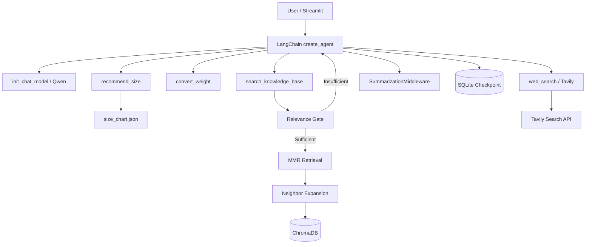

# FashionAdvisor Agent 👔

> 基于 LangChain 的智能服装顾问 Agent：将本地服装知识、结构化尺码规则、联网搜索与持久化会话整合到一个单 Agent 系统中，并提供 Streamlit 可视化交互界面。

## 项目简介

FashionAdvisor Agent 面向以下典型场景：

- **服装洗护**：羊毛、棉麻、牛仔等材质如何清洗与养护；
- **颜色与场合搭配**：面试、商务、日常场景如何选择颜色；
- **尺码推荐**：根据身高、体重和版型偏好执行确定性尺码匹配；
- **实时趋势查询**：最新流行色、近期服装趋势等时效性问题；
- **多轮个性化咨询**：记住用户已提供的身高、体重、偏好和历史结论。

项目没有让所有问题都固定经过 RAG，而是让主 Agent 根据问题类型在不同能力之间自主路由：

- 确定性规则 → Python Tool；
- 本地静态知识 → Agentic RAG；
- 最新 / 外部公开信息 → Tavily Web Search；
- 普通对话 → 模型直接回答。

---

## 核心技术栈

`Python` · `LangChain` · `LangGraph` · `ChromaDB` · `SQLite` · `Qwen` · `Tavily` · `Streamlit` · `Pydantic`

---

## 系统架构



### 设计原则

```text
LLM                 -> 理解用户意图、选择工具、整合结果
Python Tool         -> 执行确定性业务规则
ChromaDB            -> 本地非结构化知识检索
Relevance Gate      -> 判断本地证据是否值得使用
Tavily              -> 补充最新 / 外部公开信息
SQLite              -> 持久化 Agent 会话状态
Summarization       -> 压缩长对话上下文
```

---

## 关键设计

### 1. 为什么尺码推荐不使用 RAG？

项目原始数据包含三类知识：

```text
data/
├── 洗涤养护.txt
├── 颜色选择.txt
└── 尺码推荐_原始数据.txt
```

其中洗涤养护、颜色搭配属于自然语言知识，适合通过 Embedding + 向量检索处理；尺码则是明确的区间映射规则，例如：

```text
身高区间 + 体重区间 -> 推荐尺码
```

因此项目将尺码规则预先结构化为：

```text
尺码推荐_原始数据.txt
        ↓
人工校验与结构化
        ↓
size_chart.json
        ↓
recommend_size Tool
```

这样由 LLM 负责识别参数和决定是否调用工具，Python 负责真正的区间计算，避免模型直接生成尺码带来的不确定性。

---

### 2. Structure-Aware Chunking

服装知识本身具有明显的标题和条目结构，例如：

```text
三、秋季服装

1. 羊毛/羊绒材质
洗涤：...
养护：...
```

如果固定每 N 个字符切分，可能把“材质标题、洗涤规则、养护规则”拆开。因此项目先根据标题和编号形成完整逻辑块：

```text
标题 / 编号结构
      ↓
Logical Section
      ↓
<= CHUNK_SIZE：保持完整
>  CHUNK_SIZE：按自然边界递归切分
      ↓
Chunk Overlap
```

超长文本才使用递归切分，并优先按照段落、换行和中文标点寻找边界。

可先预览切分结果：

```bash
python scripts/preview_chunks.py
```

---

### 3. 知识如何入库？

正式进入 RAG 的文件为：

```text
洗涤养护.txt
颜色选择.txt
```

入库流程：

```text
TXT
 ↓
文本规范化
 ↓
生成 document_id
 ↓
Structure-Aware Chunking
 ↓
生成 chunk_id + metadata
 ↓
Embedding（text-embedding-v4）
 ↓
ChromaDB
```

每个 Chunk 保存正文以及用于检索、调试和邻居扩展的 metadata，例如：

```text
source
 document_id
 chunk_id
 chunk_index
 total_chunks
 parent_title
 section_title
 section_index
 section_chunk_index
 section_total_chunks
 chunking_version
```

`chunk_id` 使用确定性连续编号，例如：

```text
<document_id>_0000
<document_id>_0001
<document_id>_0002
```

这样命中 `_0001` 后可以直接定位 `_0000 / _0002` 作为相邻上下文。

初始化知识库：

```bash
python scripts/init_knowledge_base.py
```

Streamlit 页面也提供 **“初始化 / 补充知识库”** 按钮。

---

### 4. Relevance Gate：Top-K 不等于“有答案”

向量数据库即使面对完全无关的问题，也可能从已有语料中返回几个“最相似”的结果。因此项目不会使用：

```python
if documents:
    # 认为知识库有答案
```

而是先执行相关性检索：

```text
Query
 ↓
similarity_search_with_relevance_scores
 ↓
best_score >= threshold ?
```

如果达到阈值：

```text
LOCAL_KB_STATUS=SUFFICIENT
```

继续执行 MMR + Neighbor Expansion。

如果低于阈值：

```text
LOCAL_KB_STATUS=INSUFFICIENT
```

Agent 不强行使用低相关证据，可以进一步选择联网搜索。

> `RETRIEVAL_RELEVANCE_THRESHOLD=0.45` 只是当前语料上的初始经验值，可通过 `scripts/inspect_relevance.py` 观察相关 / 无关查询的分数分布后调整。

---

### 5. MMR + Neighbor Expansion

普通 Top-K 容易检索到多个内容高度重复的 Chunk。

MMR 同时考虑：

```text
Query relevance
+
Result diversity
```

用于挑选互补的 Anchor Chunk。

随后根据确定性 `chunk_id` 补充 Anchor 前后的邻居 Chunk，从而减少切分边界导致的上下文缺失。

---

### 6. Local-first + Web Fallback

本项目将 Tavily 设计为一个独立 Tool，而不是硬编码在 Retriever 内部。

典型路由：

```text
“羊毛衫怎么洗？”
 -> search_knowledge_base
 -> Local KB sufficient
 -> 本地回答
```

```text
“今年秋冬最新流行色有哪些？”
 -> web_search
 -> Tavily
 -> 基于最新公开资料回答
```

```text
“莫代尔面料怎么护理？”
 -> search_knowledge_base
 -> LOCAL_KB_STATUS=INSUFFICIENT
 -> Agent 再调用 web_search
```

工具路由由 **主模型 + System Prompt + Tool Description** 共同完成，没有额外训练分类模型。

---

### 7. Persistent Memory + Conversation Summarization

项目使用两套互补机制：

```text
SqliteSaver              -> 保存 Agent / Message / Tool state
SummarizationMiddleware  -> 压缩过长的历史上下文
```

SQLite 解决“程序重启后历史丢失”；摘要机制解决“历史越来越长、Token 与延迟持续增长”。

默认达到以下任一条件后触发摘要：

```text
tokens >= 6000
OR
messages >= 30
```

并保留最近若干条原始消息，使最新工具调用和上下文不过度压缩。

---

## Streamlit 演示界面

Web 界面位于：

```text
app.py
```

提供：

- 多轮聊天；
- SQLite 会话恢复；
- 示例问题快捷入口；
- 本地知识库初始化；
- Tool Trace 展示；
- 当前模型 / Embedding / Tavily 状态；
- 一键清空当前会话。

Tool Trace 仅展示真实发生的工具调用与工具返回，不展示模型私有推理过程。

---

## 快速开始

### 1. 运行环境

推荐 Python **3.10 / 3.11**。

### 2. Clone

```bash
git clone <your-repository-url>
cd <repository-directory>
```

### 3. 创建虚拟环境

```bash
python -m venv .venv
```

Windows：

```bash
.venv\Scripts\activate
```

macOS / Linux：

```bash
source .venv/bin/activate
```

### 4. 安装依赖

```bash
pip install -r requirements.txt
```

### 5. 配置环境变量

复制：

```text
.env.example -> .env
```

至少填写：

```env
MODEL_API_KEY=your_dashscope_api_key
DASHSCOPE_API_KEY=your_dashscope_api_key
TAVILY_API_KEY=your_tavily_api_key
```

Qwen 通过 DashScope 的 OpenAI-compatible endpoint 调用：

```env
MODEL_PROVIDER=openai
MODEL_NAME=qwen3-max
MODEL_BASE_URL=https://dashscope.aliyuncs.com/compatible-mode/v1
```

> `.env` 已被 `.gitignore` 排除，请不要把真实 API Key 提交到 GitHub。

如果使用 Streamlit Secrets，也可以复制：

```text
.streamlit/secrets.toml.example
    -> .streamlit/secrets.toml
```

### 6. 检查配置并初始化本地知识库

```bash
python scripts/check_setup.py
python scripts/preview_chunks.py
python scripts/init_knowledge_base.py
```

### 7. 启动 Streamlit

```bash
streamlit run app.py
```

浏览器打开终端中显示的本地地址即可交互。

### 8. CLI（可选）

```bash
python main.py
```

---

## 推荐体验问题

```text
羊毛衫应该怎么洗？
```

```text
我 178cm、80kg，喜欢宽松，穿什么码？
```

```text
正式面试穿黑色合适吗？
```

```text
今年秋冬最新流行色有哪些？
```

```text
莫代尔面料怎么护理？
```

最后一个问题适合观察：

```text
Local RAG -> Relevance Gate insufficient -> Tavily fallback
```

---

## 项目目录

```text
.
├── app.py                         # Streamlit Web UI
├── main.py                        # CLI 入口
├── config.py                      # 统一配置
├── agent/
│   ├── agent_service.py           # 单 Agent 组装与调用
│   └── prompts.py                 # System Prompt / Summary Prompt
├── models/
│   └── model_factory.py           # init_chat_model / Embedding Factory
├── rag/
│   ├── text_splitter.py           # Structure-Aware Chunking
│   ├── knowledge_base.py          # 文档切分、metadata、入库
│   ├── vector_store.py            # Chroma / MMR / Relevance Search
│   └── retriever.py               # Gate + MMR + Neighbor Expansion
├── tools/
│   ├── knowledge_tool.py          # Local RAG Tool
│   ├── size_tool.py               # JSON 尺码规则 Tool
│   ├── weight_tool.py             # 确定性单位换算
│   └── web_search_tool.py         # Tavily Tool
├── memory/
│   ├── sqlite_memory.py           # LangGraph SQLite Checkpointer
│   └── summary_middleware.py      # 长对话摘要
├── data/
│   ├── 洗涤养护.txt
│   ├── 颜色选择.txt
│   ├── 尺码推荐_原始数据.txt
│   └── size_chart.json
├── scripts/
│   ├── check_setup.py             # 本地配置检查
│   ├── preview_chunks.py
│   ├── init_knowledge_base.py
│   ├── inspect_relevance.py
│   └── reset_knowledge_base.py
├── tests/
├── docs/
└── .streamlit/
```

---

## 测试与调试

建议按底层到上层顺序验证：

```bash
python scripts/preview_chunks.py
pytest tests/test_text_splitter.py -q
pytest tests/test_tools.py -q
python scripts/init_knowledge_base.py
python scripts/inspect_relevance.py
pytest tests/test_retrieval_gate.py -q
pytest tests/test_web_search.py -q
pytest tests/test_agent.py -q
```

重点不仅是最终回答是否通顺，还应观察 **Tool Trace 是否符合预期路由**。

---

## 当前边界与可扩展方向

当前项目是面向个人作品集与 Agent 工程实践的单机版本：

- ChromaDB 与 SQLite 使用本地持久化；
- Relevance Gate 阈值需要根据实际数据集继续校准；
- MMR 是轻量检索优化，后续可加入 Cross-Encoder / BGE Reranker；
- 可进一步建立检索评测集，统计 Hit@K、MRR 与 Tool Routing Accuracy；
- Web Search 可替换为其他搜索 Provider，而不改变本地 Retriever；
- 如果需要多人在线部署，可将会话状态与数据持久化迁移到更适合并发的数据库。

---

## 一句话总结

> 这是一个将 **LLM 意图理解与工具调度、本地 Agentic RAG、确定性业务规则、实时 Web Search 和持久化 Memory** 组合在一起的单 Agent 应用，并通过 Streamlit 提供可直接体验的交互界面。
